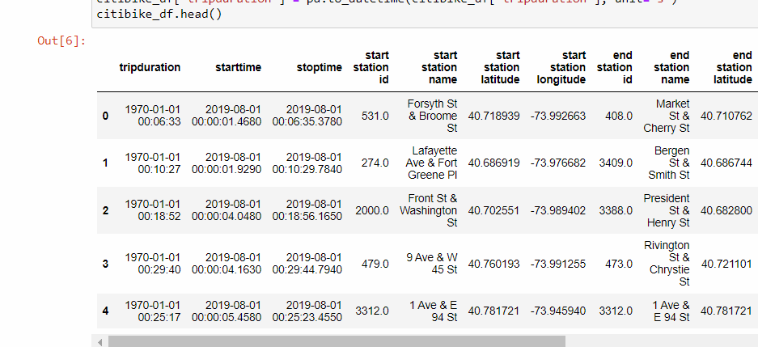
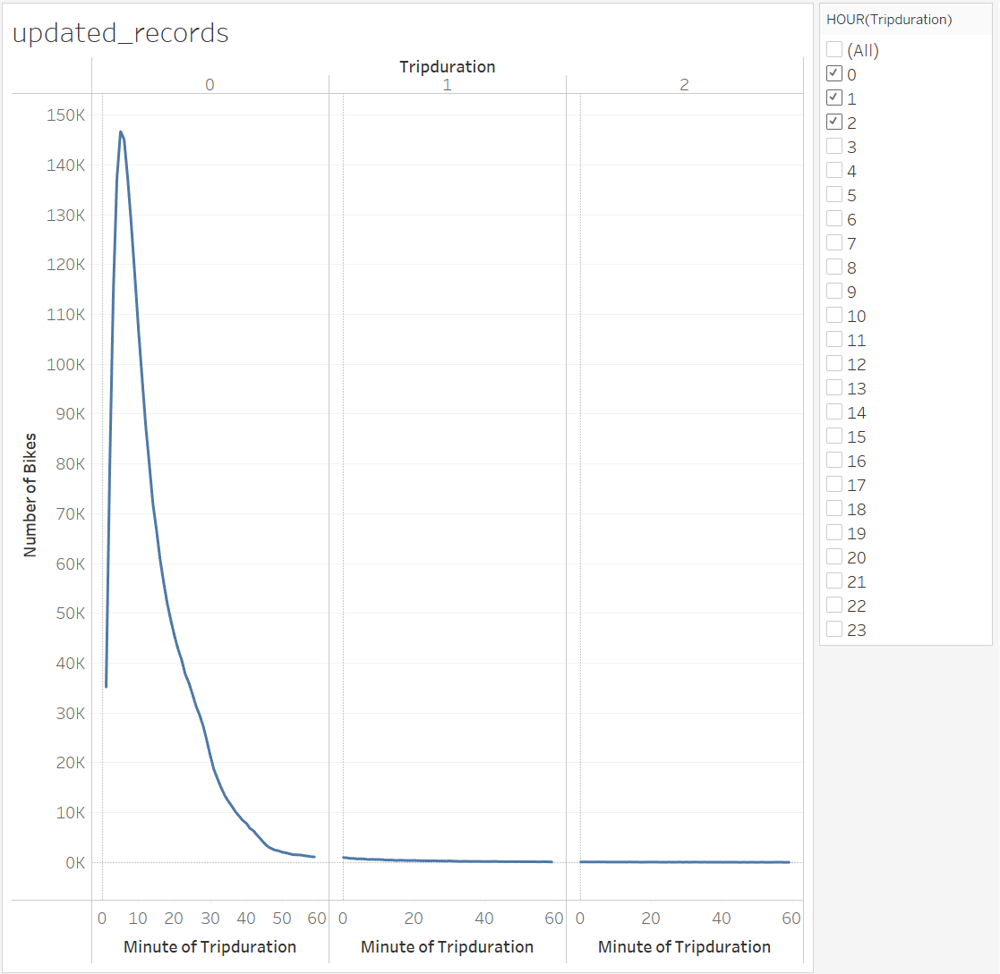
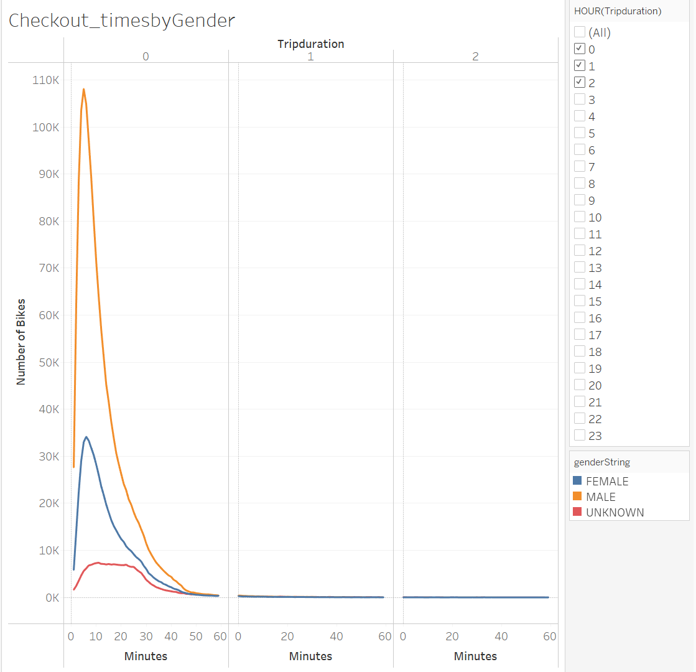
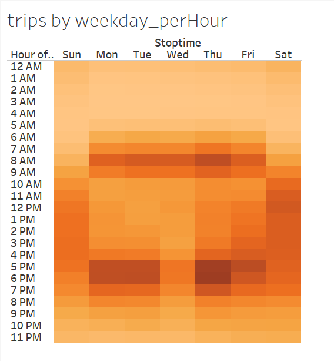
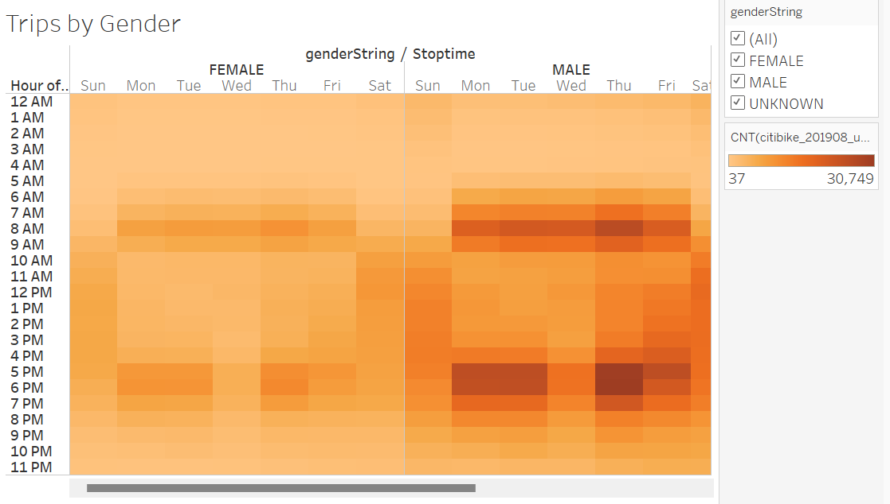
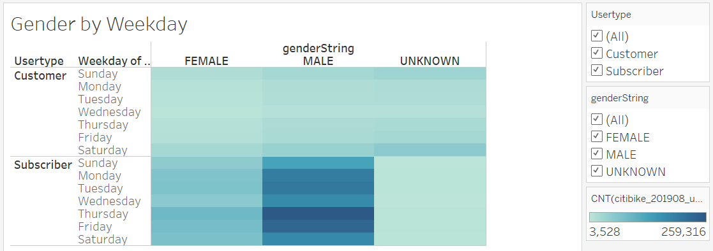
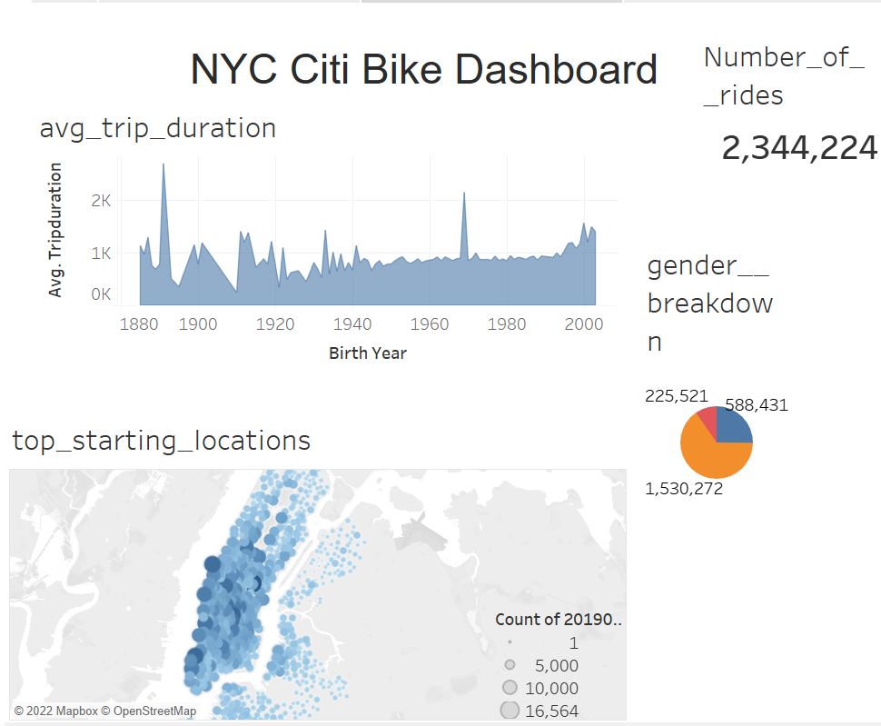
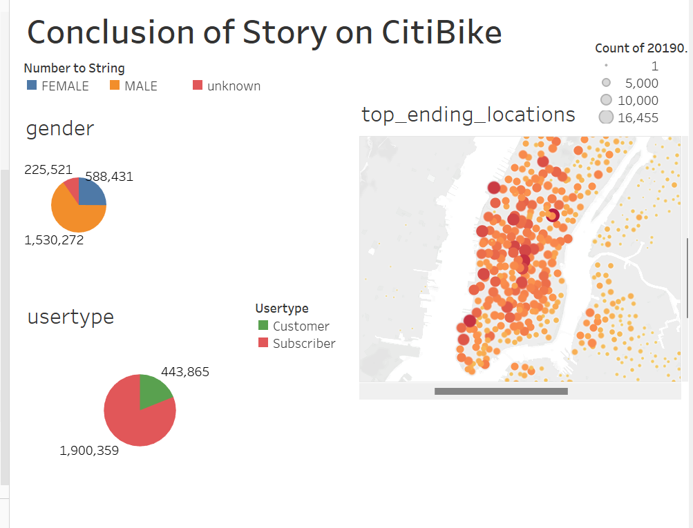
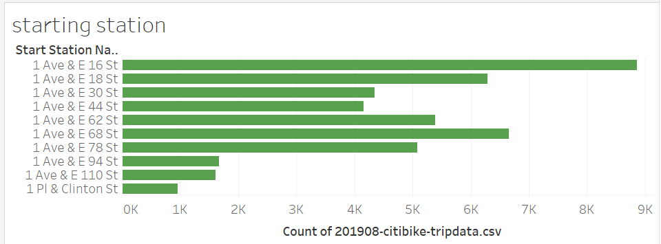
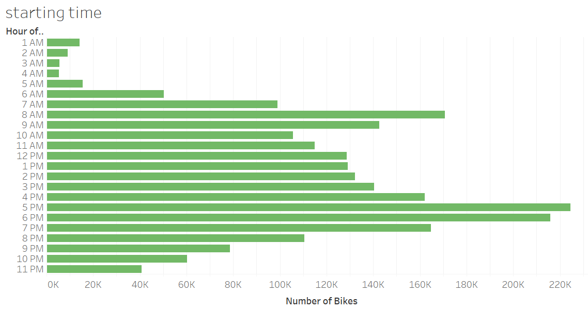

## Link to tableau : 
 https://public.tableau.com/app/profile/umang8479/viz/citibike_challenge_16638178147760/CitiBikeStory?publish=yes
# bikesharing
## Purpose:
     In this project we want to further analyze to convince the investors for bike-sharing program in Des Moines. This seemed to be an interesting and profitable project so the analysis with tableau had to be convincing. 
## Results:
   - The first analysis was to convert the "tripduration" column from an integer to a datetime datatype to get the time in hours, minutes, and seconds.

- The next analysis gave us graph the length of time that bikes were checked out for all riders.

- Next, we also analyzed and produced graph of  graph the length of time that bikes were checked out for each gender. 

 - We were keen to know the number of bike trips by weekday for each hour of the day so created a heatmap.

- Next, we also wanted to know bike trips by gender for each hour of each day of the week so created another heatmap.

- Finally another heatmap was created to analyze  that shows the number of bike trips broken down by gender for each day of the week by each Usertype.

- In conclusion two dashboards were created in order to summarize our findings as follows and to give a better cross-reference to our findings.

     
## Summary:
    There is more that could be analyzed with citibike data. Like, we can look which are the top 10 stations which are used as starting point, as seen in graph.

- Another, visualization that we can look into is which are the top times that citibikes are used more, in the graph as below.

   
